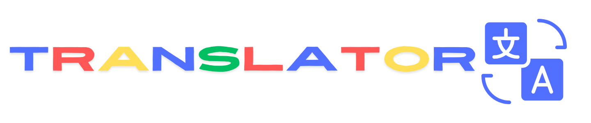

# google-ai-api-translator

O **Translate App** é uma aplicação web simples que permite traduzir texto para diferentes idiomas.

## Funcionalidades

- Basta cilcar no microfone e falar.
- Escolha o idioma de destino no menu suspenso.
- Clique no botão de transcrição para ouvir a tradução.

## Tecnologias Utilizadas

- HTML5
- CSS3 (Bootstrap)
- JavaScript (ES6)
- Google Gemini

## Como Usar

1. Clone este repositório.
2. abra o termina na pasta cloanda
3. digite o comando npm install
4. inclua um arquivo api-key.txt com sua api-key ou insira-a no prompt do navegador
5. Abra o arquivo `index.html` em um navegador da web.
6. Comece a traduzir!

obsI. caso não consiga rodar este projeto em sua máquina, acesse: https://google-ai-api-translator.vercel.app/
obsII. este projeto não é compatível com o navegador mozilla em todas suas versões.
## Contribuição

Contribuições são bem-vindas! Sinta-se à vontade para abrir problemas ou enviar pull requests.

## Licença

Este projeto é open-source.